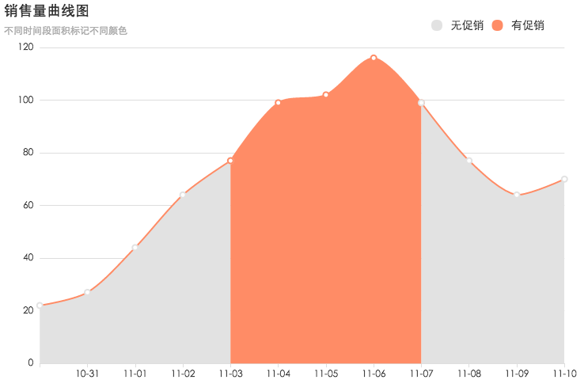
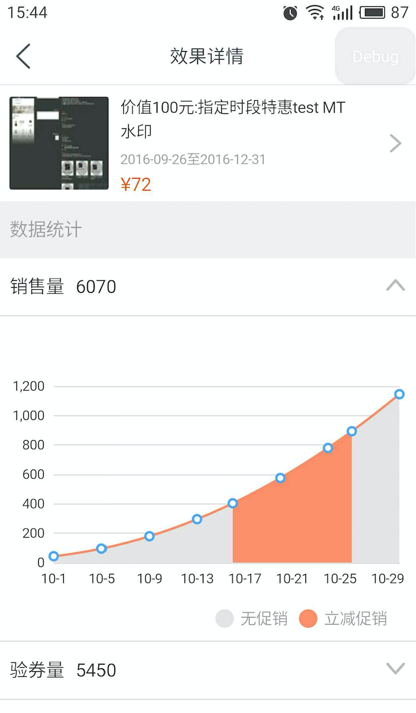

ECharts很强大，所以各种配置项和参数也超多，要想画出想要的效果，还真是一个细致活儿。在项目中使用echarts需要先 npm install echarts --save 或者直接下载js文件引入到项目中。
可以先在官网上用模拟数据调试好配置项，然后把options直接copy到项目里，刚开始不知道可以在官网上调试，耽误了好多时间。
这次画的曲线有一个特点：有促销和无促销的面积区域需要用颜色区分，有促销：橙色，无促销：灰色。

<div align="center">

</div>

<!-- more -->
### 最终效果


### 代码
下面是在ECharts调试的代码，也可以到http://gallery.echartsjs.com/editor.html?c=xHJpzlHKQe查看
- 按照时间顺序和每天的状态status，将数据分割成多个series,每个series设置不同的areaStyle和itemStyle。
- 图例的颜色会与itemStyle.normal.color的颜色相同，例如这里有两个图例legend：有促销和无促销，它们的颜色对应series中有相同name的itemStyle.normal.color。
- 所以如果itemStyle.normal.color要求都是蓝色，图例就不能按需求展示有促销为橙色，无促销为灰色，而是展示的itemStyle.normal.color。
- 所以其实项目中的图例是我自己画的，并不是用的echarts的legend属性
```javascript
// 数据 status为0表示这一天无促销，为1表示有促销
var effectDTOList = [
    { "date": "2016-10-30", "salesCnt": 22, "status": 0 }, 
    { "date": "2016-10-31", "salesCnt": 27, "status": 0 }, 
    { "date": "2016-11-01", "salesCnt": 44, "status": 0 }, 
    { "date": "2016-11-02", "salesCnt": 64, "status": 0 }, 
    { "date": "2016-11-03", "salesCnt": 77, "status": 1 }, 
    { "date": "2016-11-04", "salesCnt": 99, "status": 1 }, 
    { "date": "2016-11-05", "salesCnt": 102, "status": 1 }, 
    { "date": "2016-11-06", "salesCnt": 116, "status": 1 }, 
    { "date": "2016-11-07", "salesCnt": 99, "status": 0 }, 
    { "date": "2016-11-08", "salesCnt": 77, "status": 0 }, 
    { "date": "2016-11-09", "salesCnt": 64, "status": 0 }, 
    { "date": "2016-11-10", "salesCnt": 70, "status": 0 }
    ];
//准备数据源和配置项
var xAxis = [], //x轴数据
    yAxis = [], //y轴数据
    data = [],  //每个系列（series）图表数据，是个二维数组
    series = [], 
    seriesItem;
var st = effectDTOList[0].status;
for (var i = 0; i < effectDTOList.length; i++) {
    var date = effectDTOList[i].date.substring(5);
    xAxis.push(date);
    yAxis.push(effectDTOList[i].salesCnt);
    data.push([date, effectDTOList[i].salesCnt]);
    if (st != effectDTOList[i].status || (i == effectDTOList.length - 1)) {
        var color = st == 1 ? '#ff8c66' : "#e2e2e2";
        var name1 = st == 1 ? '有促销' : "无促销";
        seriesItem = {
            name: name1,
            type: 'line',
            smooth: true,
            symbolSize: 7, //转折点的大小
            data: data,
            areaStyle: {
                normal: {
                    color: color,
                    opacity: 1
                }
            },
            lineStyle: { //曲线样式
                normal: {
                    color: '#ff8c66'
                }
            },
            itemStyle: { //转折点的样式
                normal: {
                    color: color,
                    borderWidth: 2,
                    borderType: 'solid'
                }
            }
        };
        series.push(seriesItem);
        data = [
            [date, effectDTOList[i].salesCnt]
        ];
        st = effectDTOList[i].status;
    }
}
//配置项
option = {
    grid: {
        left: '3%',
        right: '4%',
        bottom: '3%',
        containLabel: true
    },
    title: {
        text: '销售量曲线图',
        subtext: '不同时间段面积标记不同颜色'
    },
    legend: {
        right: 50,
        top: 20,
        data: [{
                name: '无促销',
                icon: 'circle',
                textStyle: {
                    color: '#333',
                    fontSize: '14'
                }
            }, {
                name: '有促销',
                icon: 'circle',
                textStyle: {
                    color: '#333',
                    fontSize: '14'
                }
            }

        ]
    },
    //工具栏
    toolbox: {  
        feature: {
            saveAsImage: {}  //下载图片
        }
    },
    //缩放配置
    dataZoom: [{
        type: 'inside', //内嵌缩放，如鼠标滚轮滚动、两指滑动
        xAxisIndex: [0] //x轴可缩放
    }],
    tooltip: {
        trigger: 'axis',
        formatter: function(params) {
            for (let i = 0; i < params.length; i++) {
                if (params[i].value) {
                    return params[i].value[1];
                }
            }
            return 'loading';
        },
        backgroundColor: '#ff6633',
        padding: [10],
        axisPointer: {
            lineStyle: {
                color: '#ddd'
            }
        }

    },
    xAxis: {
        axisTick: {
            show: true
        },
        type: 'category',
        boundaryGap: false,
        data: xAxis,
        axisLine: {
            lineStyle: {
                color: '#ddd'
            }
        },
        axisLabel: {
            textStyle: {
                color: '#333'
            }
        }
    },
    yAxis: {
        axisTick: {
            show: false
        },
        type: 'value',
        axisLine: {
            show: false
        },
        splitLine: {
            lineStyle: {
                color: '#ddd'
            }
        }
    },
    series: series
};
```

### 参考

- [ECharts官网](http://echarts.baidu.com/tutorial.html)

- [ECharts GitHub](https://github.com/ecomfe/echarts)
