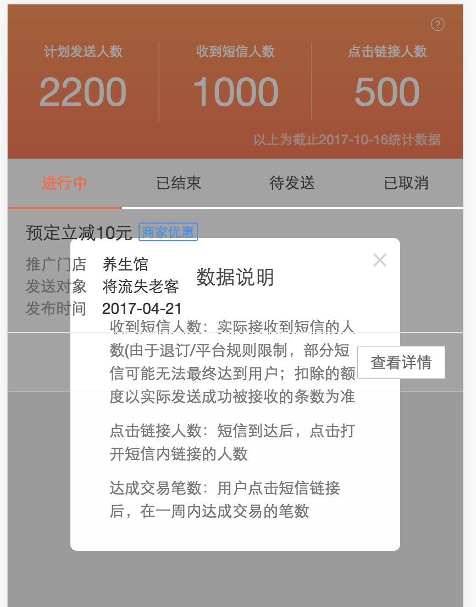
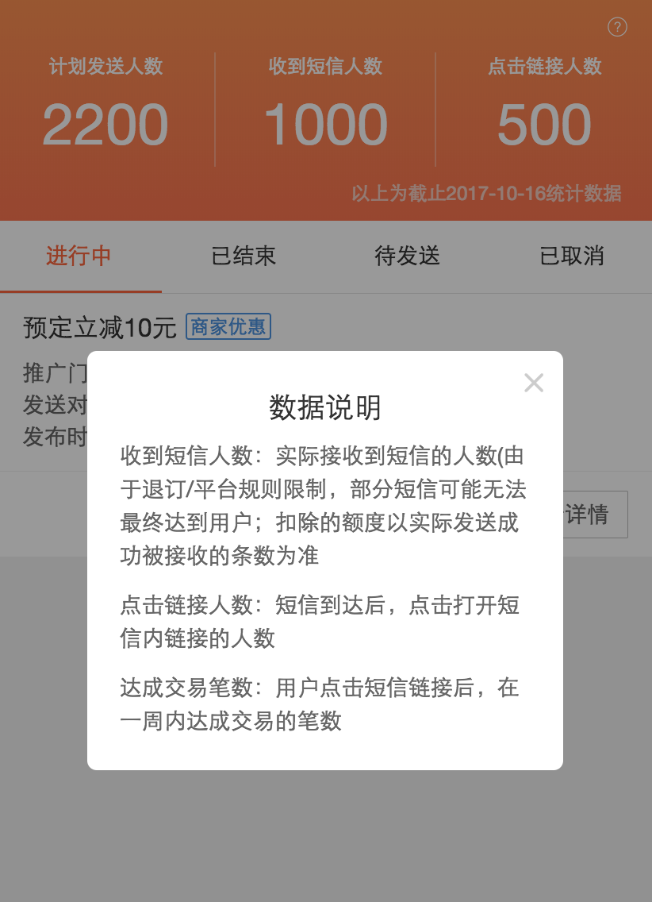
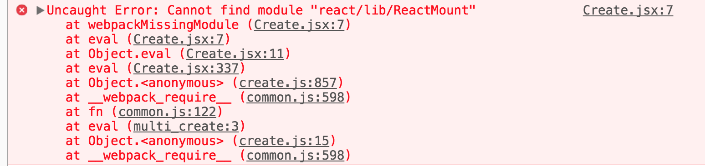

React16更换了协议，在此之前的版本都可能存在版权问题，新的项目和脚手架都需要升级到16.0。

<!--more-->
## React16新特性Portal

在React16没有提供ReactDOM.createPortal(child, container)之前，在组件中写弹出框可能会出现左图的情况。具体可以看[Portals](https://github.com/chang20159/react-doc/blob/master/React高级指南/React高级指南（十三）Portals.md)

<div style="display:flex;">
	
	
</div>

在使用已有的弹出框组件时，也可能出现左图的情况。像下面这样通过this.state.visible控制弹出层的显示/隐藏。

```xml
 <Dialog visible={this.state.visible}>
    <Dialog.Title>数据说明</Dialog.Title>
    <Dialog.Body>
       {//...}
    </Dialog.Body>
</Dialog>
```

我们可以按照官方文档的示例方法封装一个组件Modal。

```javascript
import React,{ Component } from 'react'
import ReactDOM from 'react-dom'
const modalRoot = document.getElementsByTagName('body')[0]

export default class Index extends Component {
    constructor(props) {
        super(props)
        this.el = document.createElement('div')
      }
    
      componentDidMount() {
        modalRoot.appendChild(this.el)
      }
    
      componentWillUnmount() {
        modalRoot.removeChild(this.el)
      }
    
      render() {
        return ReactDOM.createPortal(
          this.props.children,
          this.el,
        )
      }
}
```

然后这样使用：

```xml
{
    this.state.visible && (
        <Modal>
            <Dialog visible={true}>
                <Dialog.Title>数据说明</Dialog.Title>
                <Dialog.Body>
                   {//...}
                </Dialog.Body>
            </Dialog>
        </Modal>
    )
}
```
this.state.visible为true时会装载Modal组件，this.state.visible 为false时会卸载Modal组件，从而控制Dialog显示/隐藏，这个过程Dialog都是在body下面，解决了层叠显示的问题。

## 升级版本

|包名|升级后版本|
|:--|:--|
|react|16.0.0|
|react-dom|16.0.0|
|react-router|3.2.0|
|react-hot-loader|3.1.2|

### react-hot-loader

<p style="color:red;">Create.jsx:7 Uncaught Error: Cannot find module "react/lib/ReactMount"</p>



升级react-hot-loader版本："react-hot-loader": "^3.1.2",


### webpack配置react-hot-loader
<p style="color:red;">client:75 Loader /Users/chang/merchant/gm-marketing-sms-static/node_modules/_react-hot-loader@3.1.2@react-hot-loader/index.js didn't return a function
 @ multi create</p>

 
原来的配置：
 
```
{
    test: /\.(jsx|es6)$/,
    loaders: ['react-hot', 'babel'],
    exclude: /node_modules/
}
```
 
修改成：
 
``` 
{
    test: /\.(jsx|es6)$/,
    loaders: ['babel'],
    exclude: /node_modules/,
    options: {
        cacheDirectory: true,
        plugins: [
            'react-hot-loader/babel'
        ]
    }
}
```

### router

```javascript
import { Redirect, Router, Route, useRouterHistory } from 'react-router'
import { createHashHistory } from 'history'
 
this.history = useRouterHistory(createHashHistory)({ queryKey: false })
  
render() {
    return (
        <Router history={this.history}>
            <Route path="/index" name="index" component={Index} />           
            <Redirect from="/" to="/index" />
        </Router>
    );
}
```

## 参考

- [React v16.0](https://reactjs.org/blog/2017/09/26/react-v16.0.html)

 
