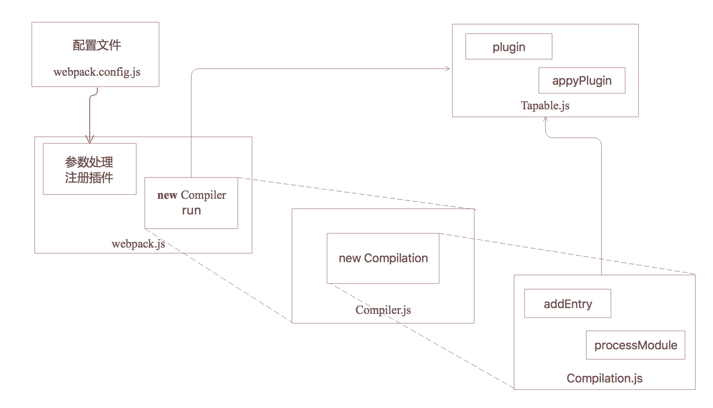

<!--more-->
## webpack编译流程

webpack编译module都是这么个调用流程：

- 将配置文件导出的对象作为webpack的参数，返回一个Compiler的实例compiler。这里会做很多参数处理、还有注册各种插件形成一个插件的事件流。
- 然后调用实例方法 compiler.run(callback)，依次触发事件流，执行插件任务。

```javascript
var webpack = require('webpack')
var webpackConfig = require('./webpack.config.js')
var compiler = webpack(webpackConfig)
compiler.run(function (err, stats) {
    if (err) console.log(err)
});
```

**下面来看调用webpack(webpackConfig)都发生了什么？**

```javascript
function webpack(options, callback) {
	//设置options的默认值，如output.path的默认值为process.cwd()，target的默认值为web
	new WebpackOptionsDefaulter().process(options);
	compiler = new Compiler();
	//指定上下文context
	compiler.context = options.context;
	compiler.options = options;
	//注册nodeEveironmentPlugin插件，触发‘before-run’时执行
	new NodeEnvironmentPlugin().apply(compiler);
	//注册配置文件中的所有插件
	compiler.apply.apply(compiler, options.plugins);
	//触发environment和after-environment事件
	compiler.applyPlugins("environment");
	compiler.applyPlugins("after-environment");
	//处理参数，例如为不同的target注册插件，为externals配置注册ExternalsPlugin，为不同的devtool注册对应的插件,如果cache为true就注册CachePlugin等
	compiler.options = new WebpackOptionsApply().process(options, compiler);
	//如果有callback就会直接调用compiler.run(callback)
	if(callback) {
		...
		compiler.run(callback);
	}
	return compiler;
}

//导出webpack
exports = module.exports = webpack;
//导出各种插件,这样我们就可以直接使用插件：new webpack.DefinePlugin()
exportPlugins(exports, {
	"DefinePlugin": () => require("./DefinePlugin"),
	...
})
//new webpack.optimize.CommonsChunkPlugin()
exportPlugins(exports.optimize = {}, {
	"CommonsChunkPlugin": () => require("./optimize/CommonsChunkPlugin")
})
```

这里主要做了几件事情：

- 设置配置参数的默认值
- new一个Compiler实例
- 调用实例方法compiler.apply(plugins)或plugin.apply(compiler)注册插件,比如将nodeEveironmentPlugin插件注册在before-run阶段
- 调用compiler.applyPlugins()触发插件执行，比如compiler.applyPlugins(‘before-run’)，就会通知注册在before-run这个阶段的插件执行
- 最后导出webpack,以及webpack官方提供的一些插件


**那下面看下Compiler里面有什么？Compiler有两个类： Watching和Compiler**

- Compiler 存放输入输出相关信息、编译方法
- Watching 监听文件变化的一些处理方法

```javascript
class Watching {
	//这里先不看Watching了
	...
}
class Compiler extends Tapable {
	constructor() {
		//调用Tapable的构造函数
		super();
	}
	//编译的入口方法
	run(callback){...}
	...
}
Compiler.Watching = Watching;
module.exports = Compiler;
```

**这里的核心在于Compiler类继承了Tapable，使用Tapable实现了事件发布订阅处理的插件架构。**

前面讲到的compiler.apply(plugins)和compiler.applyPlugins(‘before-run’)方法都是继承自Tapable。我们来看下Tapable有什么来了解更多插件的发布订阅细节。

- [tapable-0.2/lib/Tapable.js](https://github.com/webpack/tapable/blob/tapable-0.2/lib/Tapable.js)

Tapable是一个典型的订阅发布模式的实现

```javascript
function Tapable() {
	this._plugins = {};
}
module.exports = Tapable;

//发布name消息
Tapable.prototype.applyPlugins = function applyPlugins(name) {
	if(!this._plugins[name]) return;
	var args = Array.prototype.slice.call(arguments, 1);
	var plugins = this._plugins[name];
	for(var i = 0; i < plugins.length; i++){
		plugins[i].apply(this, args);
	};
}
//fn订阅name消息
Tapable.prototype.plugin = function plugin(name, fn) {
	if(!this._plugins[name]) this._plugins[name] = [fn];
	else this._plugins[name].push(fn);
}
//给定一个插件数组，对其中的每一个插件调用插件自身的apply方法注册插件
Tapable.prototype.apply = function apply() {
	for(var i = 0; i < arguments.length; i++) {
		arguments[i].apply(this);
	}
};

```

目前来看，webpack已经根据参数配置注册了很多插件、并且注册了一些内部插件。但这里我们需要调用compiler.run()方法触发下一步操作:

```javascript
//Compiler.js
run(callback) {
	this.applyPluginsAsync("before-run", this, err => {
		if(err) return callback(err);
		this.applyPluginsAsync("run", this, err => {
			if(err) return callback(err);
			this.readRecords(err => {
				if(err) return callback(err);
				this.compile(onCompiled);
			});
		});
	});
}
```

执行run方法就开始了webpack的编译流程,显示异步触发了`before-run`，执行完对应的插件回调后再触发`run`。最后执行this.compile(onCompiled)。这是下一个重要步骤。


**其实核心编译流程就在这里，更细节的流程在Compilation.js中**，下面的代码可以看到在`make`阶段传入了Compilation的实例compilation。

```javascript
//Compiler.js
compile(callback) {
	const params = this.newCompilationParams();
	this.applyPluginsAsync("before-compile", params, err => {
		if(err) return callback(err);
		this.applyPlugins("compile", params);
		const compilation = this.newCompilation(params);
		this.applyPluginsParallel("make", compilation, err => {
			if(err) return callback(err);
			compilation.finish();
			compilation.seal(err => {
				if(err) return callback(err);
				this.applyPluginsAsync("after-compile", compilation, err => {
					if(err) return callback(err);
					return callback(null, compilation);
				});
			});
		});
	});
}
```

那我们要知道在`make`这个阶段做了什么，查看初始化时注册插件的那段源码可以知道，在`make`这个阶段根据配置文件中entry字段的值注册了对应的插件：SingleEntryPlugin、MultiEntryPlugin、DynamicEntryPlugin。entry配置与插件怎么对应的可以查看源码 [EntryOptionPlugin.js](https://github.com/webpack/webpack/blob/master/lib/EntryOptionPlugin.js)

那我们webpack编译的入口从这几个入口插件开始，这里只看下 [SingleEntryPlugin](https://github.com/webpack/webpack/blob/master/lib/SingleEntryPlugin.js)

```javascript
class SingleEntryPlugin {
	constructor(context, entry, name) {
		this.context = context;
		this.entry = entry;
		this.name = name;
	}
	apply(compiler) {
		...
		compiler.plugin("make", (compilation, callback) => {
			const dep = SingleEntryPlugin.createDependency(this.entry, this.name);
			compilation.addEntry(this.context, dep, this.name, callback);
		});
	}
	...
}
module.exports = SingleEntryPlugin;
```
前面看过注册插件时会调用插件的apply方法，注册某个阶段的执行函数。在这里可以看到注册在`make`阶段的SingleEntryPlugin插件，在触发`make`阶段时会做什么。当触发`make`阶段时会执行这个函数:

```javascript
(compilation, callback) => {
	const dep = SingleEntryPlugin.createDependency(this.entry, this.name);
	compilation.addEntry(this.context, dep, this.name, callback);
}
```

在这里调用了 `compilation.addEntry(this.context, dep, this.name, callback);` ，就这样，webpack编译从入口模块开始了。

至于调用compilation.addEntry后干了什么，大概就是 解析模块、分析模块依赖、对每个模块用相应的loader处理。整个`make`阶段处理完毕后进入`seal`阶段，封装构建结果，最后进入emit阶段输出结果。


**比较核心的几个文件和方法： webpack.js > Compiler.js(run > compile) > Compilation.js(addEntry)。 其中 Compiler 和 Compilation都继承了 Tapable.**

编译过程大致经历的阶段以及在各阶段注册的插件： 

|阶段|插件|
|:--|:--|
|before-run|[NodeEnvironmentPlugin](https://github.com/webpack/webpack/blob/master/lib/node/NodeEnvironmentPlugin.js)|
|run|[CachePlugin](https://github.com/webpack/webpack/blob/master/lib/CachePlugin.js)|
|before-compile|[DllReferencePlugin](https://github.com/webpack/webpack/blob/master/lib/DllReferencePlugin.js)|
|**compile**|[DllReferencePlugin](https://github.com/webpack/webpack/blob/master/lib/DllReferencePlugin.js)<br/>[ExternalsPlugin](https://github.com/webpack/webpack/blob/master/lib/ExternalsPlugin.js)<br/>[DelegatedPlugin](https://github.com/webpack/webpack/blob/master/lib/DelegatedPlugin.js)|
|this-compilation|...|
|compilation|...|
|make|[SingleEntryPlugin](https://github.com/webpack/webpack/blob/master/lib/SingleEntryPlugin.js)<br/>[ MultiEntryPlugin](https://github.com/webpack/webpack/blob/master/lib/MultiEntryPlugin.js)<br/>[DynamicEntryPlugin](https://github.com/webpack/webpack/blob/master/lib/DynamicEntryPlugin.js)|
|build-module|[SourceMapDevToolModuleOptionsPlugin](https://github.com/webpack/webpack/blob/master/lib/SourceMapDevToolModuleOptionsPlugin.js)|
|finish-modules|...|
| **seal**|...|
| ...|...|
|optimize-chunks|[CommonsChunkPlugin](https://github.com/webpack/webpack/blob/master/lib/optimize/CommonsChunkPlugin.js)
|optimize-chunk-assets|[UglifyJsPlugin](https://github.com/webpack-contrib/uglifyjs-webpack-plugin)|
| ...|...|
|**after-seal**|...|
|**after-compile**|...|
|emit|[LibManifestPlugin](https://github.com/webpack/webpack/blob/master/lib/LibManifestPlugin.js)|
|after-emit|[SizeLimitsPlugin](https://github.com/webpack/webpack/blob/master/lib/performance/SizeLimitsPlugin.js)|
|done|...|

有些插件会在不同的阶段都有注册不同的处理方法，比如 [CachePlugin](https://github.com/webpack/webpack/blob/master/lib/CachePlugin.js)、[ProgressPlugin](https://github.com/webpack/webpack/blob/master/lib/ProgressPlugin.js)。webpack编译过程分的很细致，提供很多个阶段，涉及很多的插件，就没有一一列出来了。

**参考源码**

- [webpack/lib/webpack.js](https://github.com/webpack/webpack/blob/master/lib/webpack.js)
- [webpack/lib/Compiler.js](https://github.com/webpack/webpack/blob/master/lib/Compiler.js)
- [webpack/lib/WebpackOptionsApply.js](https://github.com/webpack/webpack/blob/master/lib/WebpackOptionsApply.js)
- [tapable-0.2/lib/Tapable.js](https://github.com/webpack/tapable/blob/tapable-0.2/lib/Tapable.js)
- [webpack/lib/Compilation.js](https://github.com/webpack/webpack/blob/master/lib/Compilation.js)

## 插件开发

插件开发：

- 实现一个apply方法，以[Compiler](https://github.com/webpack/webpack/blob/master/lib/Compiler.js)对象compiler作为参数，Compiler类继承Tapable
- 在apply方法中调用compiler.plugin(name,fn)注册插件，其中fn是订阅name的函数。（Compilation中的插件同理）

### EntryOptionPlugin

- [EntryOptionPlugin](https://github.com/webpack/webpack/blob/master/lib/EntryOptionPlugin.js)

```javascript
const SingleEntryPlugin = require("./SingleEntryPlugin");
const MultiEntryPlugin = require("./MultiEntryPlugin");
const DynamicEntryPlugin = require("./DynamicEntryPlugin");

function itemToPlugin(context, item, name) {
	if(Array.isArray(item)) {
		return new MultiEntryPlugin(context, item, name);
	}
	return new SingleEntryPlugin(context, item, name);
}

module.exports = class EntryOptionPlugin {
	apply(compiler) {
		compiler.plugin("entry-option", (context, entry) => {
			if(typeof entry === "string" || Array.isArray(entry)) {
				compiler.apply(itemToPlugin(context, entry, "main"));
			} else if(typeof entry === "object") {
				Object.keys(entry).forEach(name => compiler.apply(itemToPlugin(context, entry[name], name)));
			} else if(typeof entry === "function") {
				compiler.apply(new DynamicEntryPlugin(context, entry));
			}
			return true;
		});
	}
};
```
### 常用插件

- [extract-text-webpack-plugin](https://github.com/webpack-contrib/extract-text-webpack-plugin)
- [uglifyjs-webpack-plugin](https://github.com/webpack-contrib/uglifyjs-webpack-plugin)
- [CommonsChunkPlugin](https://github.com/webpack/webpack/blob/master/lib/optimize/CommonsChunkPlugin.js)


## loader开发

loader主要接收一个模块文件，以及loader处理需要的参数，然后执行相应的处理逻辑返回新的模块文件。然后还要支持链式进入下一个loader处理，比如 style-loader!css-loader!less-loader这种，依次经过less-loader、css-loader、style-loader处理。


### babel-loader

babel-loader最终调用的是babel-core提供的babel.transform(source, options)，剩下的就是babel转码的事了。

```javascript
const transpile = function(source, options) {
	...
	result = babel.transform(source, options);
	const code = result.code;
   const map = result.map;
   const metadata = result.metadata;
   return {
	    code: code,
	    map: map,
	    metadata: metadata
   };
}
module.exports = function(source, inputSourceMap) {
	...
	const { code, map, metadata } = transpile(source, options);
	this.callback(null, code, map);
}

```

### 常用loader

- [css-loader](https://github.com/webpack-contrib/css-loader)
- [less-loader](https://github.com/webpack-contrib/less-loader)
- [babel-loader](https://github.com/babel/babel-loader)
- [vue-loader](https://github.com/vuejs/vue-loader)
- [file-loader](https://github.com/webpack-contrib/file-loader)

## webpack参数配置
- [webpack参数配置](https://doc.webpack-china.org/configuration/)


		