<div align="center">

</div>

<!--more-->

## 单位

### CSS中的单位
#### 相对单位

|font-size相关|说明|
|:---|:---|
| rem |相对于根元素(html元素)的font-size|
| em |相对于元素的font-size的计算值|
| ex |相对于元素字体的小写x的高度|
| ch |相对于元素字体中的字形“0”的宽度|
	
|viewport相关|说明|
|:---|:---|
| vw |相对于视口宽度	`1vw = window.innerWidth * 1%`|
| vh |相对于视口高度 `1vw = window.innerHeight * 1%`|
| vmin|vw和vh中较小的值|
| vmax|vw和vh中较大的值|	

> `window.innerHeight`		
> 浏览器窗口的视口（视觉视口）高度（单位：像素，大小是css像素的数量），包括水平滚动条。
	
> `window.innerWidth`			
> 浏览器视口（视觉视口）宽度（单位：像素，大小是css像素的数量），包括垂直滚动条。

#### 绝对单位	
- px
	- 与设备屏幕相关
	- 对于普通屏幕，通常是显示器的一个设备像素（点）
	- 对于打印机或高分辨率的屏幕，一个CSS像素对应多个设备像素
	
### 安卓中的单位 
  - dp
  	- 在定义UI布局时使用的虚拟像素单位，用于以密度无关方式表示布局维度或位置
  	- 1dp = 160 dpi 屏幕上的1个物理像素
  	- 在定义应用的 UI 时应始终使用 dp 单位 ，以确保在不同密度的屏幕上正常显示 UI
  - sp
  - px
 
### ios中的单位 
- pt 
- px 

### 参考

- [安卓多屏支持](https://developer.android.com/guide/practices/screens_support.html)
- [CSS Values and Units Level 3](https://www.w3.org/TR/css3-values/#lengths)
- [CSS的值和单位](https://developer.mozilla.org/zh-CN/docs/Learn/CSS/Introduction_to_CSS/Values_and_units)

## 像素（pixel）

### 设备像素（physical pixel）
  
  设备像素又称`物理像素`（physical pixel），是显示器中最小的物理单元，设备能控制显示的最小单位。 每个像素根据操作系统的指示设置自己的颜色和亮度。
  
  **任何设备的物理像素数量都是固定的**。
  
### 设备独立像素DIP
	
由程序使用并控制的虚拟像素，比如web编程中的CSS像素(px)、安卓（dp）、ios系统(pt)中的设备独立像素.


### CSS像素
	
CSS像素是Web编程中的概念，浏览器使用的抽象单元。 通常，CSS像素被称为与设备无关的像素（DIP）。在标准密度显示器上，1个CSS像素对应于1个设备像素。
	
例如：
	
```xml
<div height="200" width="300"></div>
```
在普通屏幕上绘制200x300设备像素，在retina显示屏上为保证相同的物理尺寸，相同的div将使用400x600设备像素，这样在Retina显示屏上，相同物理表面的设备像素数量是普通显示屏的四倍。
	
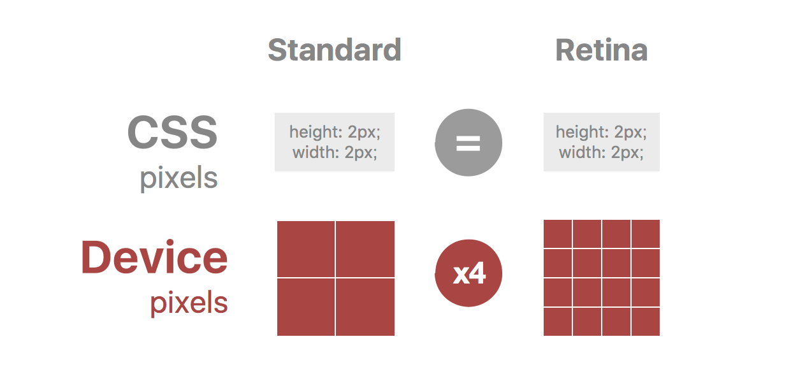


### 设备像素与设备独立像素

设备像素与设备独立像素有一定的对应关系，我们编程时控制的是设备独立像素，然后由相关系统转换为物理像素。

一个CSS像素相当于多少个设备像素由屏幕特性（是否是高密度）和缩放比例决定。放大得越大，一个CSS像素覆盖的设备像素越多。

### 分辨率
 
 显示器能显示的物理像素的数量，显示器可显示的像素越多，画面就越精细。
	
### 屏幕像素密度(Screen density)

屏幕像素密度是指物理表面的像素数量，通常以每英寸像素测量（PPI，pixel per inch）。ppi的值越高，画质越好。
	
苹果公司为其双重密度显示器创造了“Retina”营销术语，声称人眼不再能够将屏幕上的各个像素与“自然”观看距离区分开来。

<div align="center">
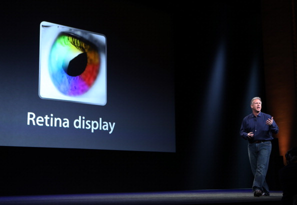
</div>
	
要计算显示器的屏幕像素密度（每英寸像素值），首先要确定屏幕尺寸和分辨率。

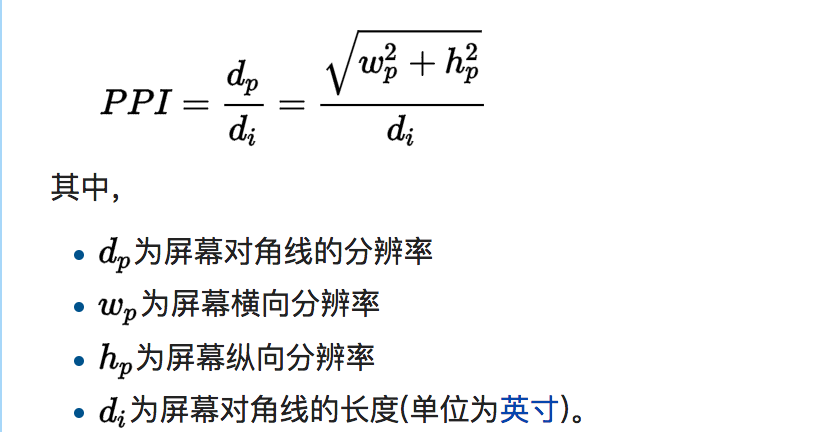

	
例如，苹果的iphone6s，像素分辨率： 1334 x 750，对角线长度4.7英寸。
<div align="center">
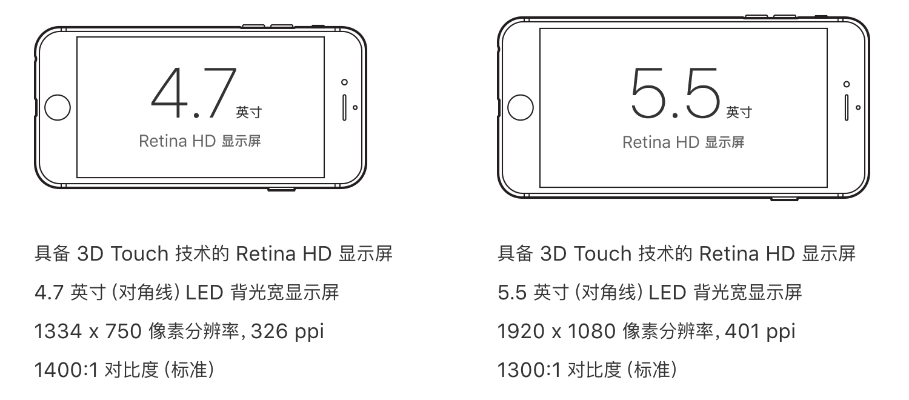
</div>	
那屏幕像素密度就是：

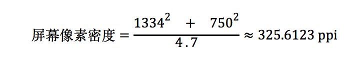	

苹果公司认为，人类能肉眼识别的最高像素密度是300ppi
<div align="center">
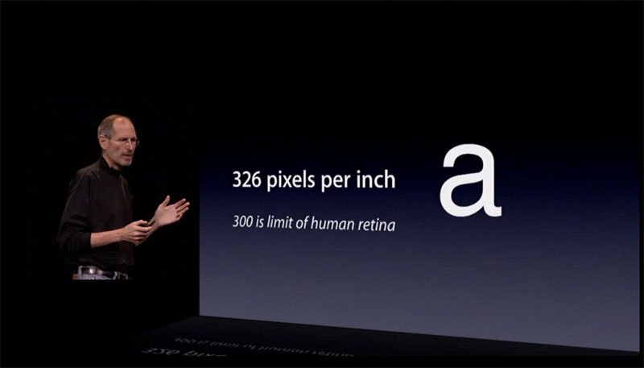
</div>

现在也有越来越多高分辨率的安卓手机（显示屏）与苹果iPhone的视网膜显示器相同。	
根据屏幕每英寸像素值的不同，Android系统的开发者将平板电脑和手机的屏幕分成五类：
	
|名称|显示等级|每英寸像素值|相似ppi的ios设备分类|
|:--|:--|:--|:--|
|LDPI	@0.75x|低等像素密度	|大约120ppi|
|MDPI	@1x|中等像素密度	|大约160ppi|标准点@1x
|HDPI	@1.5x|高等像素密度	|大约180ppi|
|XHDPI	@2x|极高像素密度	|大约320ppi|视网膜 @2x
|XXHDPI @3x|超高像素密度	|大约480ppi|高清视网膜 @3x


### 设备像素比dpr

 - 缩放比为1时的物理像素分辨率与CSS像素分辨率的比值
 - 在js中可以通过	`window.devicePixelRatio`获取，也可以重写`window.devicePixelRatio`来更改dpr
 - css中可以使用媒体查询  device-pixel-ratio
	
### 位图像素（Bitmap Pixel）
	
`位图像素`是基于栅格的图像（JPG、PNG、GIF）中最小的单位，每个像素都包含屏幕上的显示信息，如位置、颜色等，有的图像信息还包含不透明度（Alpha Channel）。
<div align="center">	
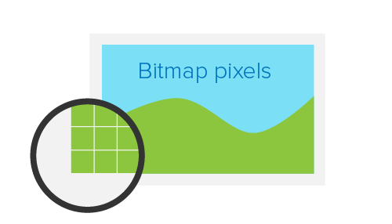
</div>		

位图图像除了自有的光栅分辨率，在web网页中有一个用CSS像素定义的抽象尺寸，web浏览器根据CSS设置的高度和宽度属性在屏幕上绘制基于栅格的图像，根据CSS尺寸可能会挤压或拉伸图像。
	
当在标准密度显示器上以完整尺寸绘制光栅图像时，1个位图像素对应1个设备像素，图像完全保真显示。因为位图像素不能进一步分割，在retina显示屏中，位图像素应该是标准屏上的4倍才能保真高清显示。

<div align="center">	
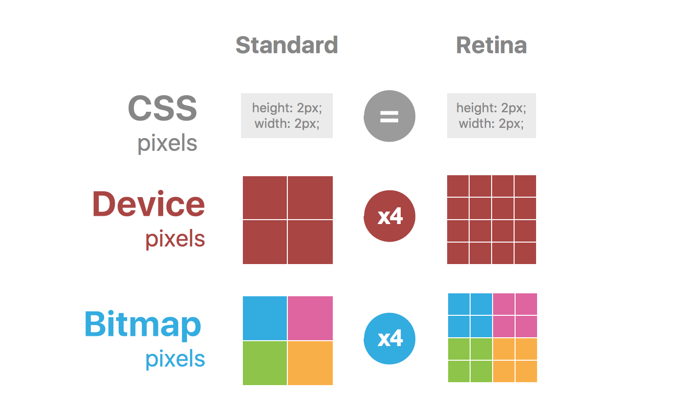
</div>	

通常为Retina屏提供图像的方法是通过使用HTML或CSS编程手段将图像容器尺寸减半。

例如，要展示 200 x 300像素的图像（这是css像素），可以向服务器请求位图分辨率为400 x 600像素（4倍）的图像。
	
```xml

```

```css
img{
	width:200px;
	height: 300px;
}
```
这**在标准密度显示器**上，有一个`下采样`的过程。对于位图像素400x600的图像，要在200 x 300的设备像素上展示，需要对其进行2倍下采样，得到（400/2）x（600/2）的分辨率图像。那其实就是把 2 x 2窗口内的位图像素变成一个像素，这个像素点的值就是窗口内所有像素的均值。

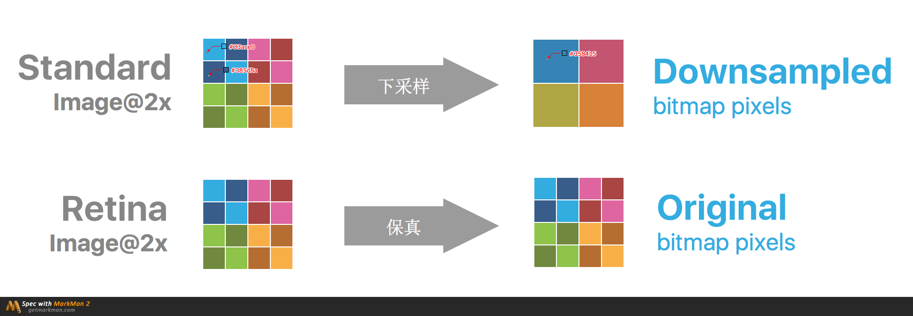

**图像下采样原理**

> 对于一幅图像I尺寸为M*N，对其进行s倍下采样，即得到(M/s)*(N/s)尺寸的得分辨率图像，当然s应该是M和N的公约数才行，如果考虑的是矩阵形式的图像，就是把原始图像s*s窗口内的图像变成一个像素。
> 
> 这个像素点的值就是窗口内所有像素的均值:
> <math xmlns="http://www.w3.org/1998/Math/MathML"><msub><mi>p</mi><mi>k</mi></msub><mo>&#xA0;</mo><mo>=</mo><mo>&#xA0;</mo><munder><mo>&#x2211;</mo><mrow><mi>i</mi><mo>&#x2208;</mo><mi>w</mi><mi>i</mi><mi>n</mi><mo>(</mo><mi>k</mi><mo>)</mo></mrow></munder><msub><mi>I</mi><mi>i</mi></msub><mo>&#xA0;</mo><mo>/</mo><mo>&#xA0;</mo><msup><mi>s</mi><mn>2</mn></msup></math>

**图像上采样原理**
>图像放大几乎都是采用内插值方法，即在原有图像像素的基础上在像素点之间采用合适的插值算法插入新的元素。

为了在Retina显示屏上能够高清保真显示图像，需要加载2倍图像。但对于标准显示屏设备，如果同样使用2倍图像，会有几个问题：

- 需要下载更大的图片资源，造成资源浪费
- 根据所使用的下采样算法，2倍图像在标准密度屏幕上会丢失一些锐度

**这就是如何在移动端不同分辨率设备中图片高清保真显示的问题**，不同屏幕密度的设备应该加载不同大小的图像，保证在不同设备上都能保真显示。
#### 移动端图片高清显示问题
##### CSS媒体查询与background-image配合使用
可以通过媒体查询的方式，对不同dpr设备使用不同分辨率的图像。

```css
.icon {
  background-image: url(example.png);
  background-size: 200px 300px;
  height: 300px;
  width: 200px;
}

@media only screen and (-Webkit-min-device-pixel-ratio: 1.5),
only screen and (-moz-min-device-pixel-ratio: 1.5),
only screen and (-o-min-device-pixel-ratio: 3/2),
only screen and (min-device-pixel-ratio: 1.5) {
  .icon {
    background-image: url(example@2x.png);
  }
}
```

dpr查询使用1.5而不是2，可以用相同的语句来查询其他非Apple设备。
这种方式主要用于使用background-image属性显示的图像。

**优点**			
- 设备仅下载合适的目标资源
- 跨浏览器兼容
- 像素精确控制

**缺点**

- 编程代码繁琐，特别是在大型网站上
- 对于内容展示型图像显示为其他HTML元素的背景，这在语义上是不正确的

##### js控制加载合适尺寸的图像
可以使用window.devicePixelRatio在Javascript中查询dpr，比CSS更容易设置图像。 然而，由于使用JavaScript，渲染可能会延迟。

```javascript
$(document).ready(function(){
  if (window.devicePixelRatio > 1) {
    var images = $('img');

    images.each(function(i) {
      var lowres = $(this).attr('src');
      var highres = lowres.replace(".", "@2x.");
      $(this).attr('src', highres);
    });
  }
});
```
这种方式比较适合展示内容型图像。

**优点**

- 易于实现
- 非Retina设备不需要下载大的图片资源
- 像素精确控制


**缺点**

- Retina设备必须下载1倍图和2倍图
- 图像替换效果在Retina设备上能体现
- window.devicePixelRatio不支持IE或Firefox。 

##### 其他方案 

- 可缩放矢量图形SVG

	不管使用什么方法，光栅图像都会被位图分辨率限制，不是无限可扩展的。但矢量图形无限缩放都不会影响清晰度
	
	```xml
	
	
	```

-  字体图标 Icon Fonts

### 参考
- [维基百科-每英寸像素](https://zh.wikipedia.org/wiki/%E6%AF%8F%E8%8B%B1%E5%AF%B8%E5%83%8F%E7%B4%A0)
- [每英寸点数](https://zh.wikipedia.org/wiki/%E6%AF%8F%E8%8B%B1%E5%AF%B8%E7%82%B9%E6%95%B0)
- [devicePixelRatio浏览器兼容性](https://developer.mozilla.org/zh-CN/docs/Web/API/Window/devicePixelRatio)
- [Towards A Retina Web](https://www.smashingmagazine.com/2012/08/towards-retina-web/)
- [图像缩放](https://baike.baidu.com/item/%E5%9B%BE%E5%83%8F%E7%BC%A9%E6%94%BE)
- [MathML公式编辑器](http://www.wiris.com/editor/demo/zh/mathml-latex)


## 视口
在桌面浏览器中只有一个视口，视口的宽度 = 浏览器窗口宽度。在小屏的移动设备（宽度240px～640px）中，如果视口宽度和浏览器宽度一样，那为桌面浏览器设计的网页在移动端查看时会很丑，所以移动端浏览器厂商会设置一个默认的移动设备的视口宽度，在768px ~ 1024px之间，最常见的宽度是980px。

### 布局视口
  
  CSS的布局将根据上面介绍的视口来计算，所以在移动端这就叫`布局视口`。
<div align="center">
	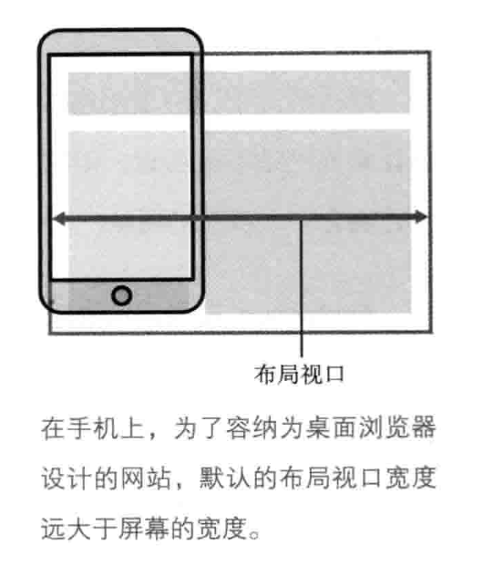
 </div>

### 视觉视口
	
虽然移动端默认的布局视口宽度可以让为桌面浏览器设计的网页很好的展示，但只会有一部分内容展示在可视区域，这个区域被称为`视觉视口`。用户可以通过缩放来操作视觉视口。
<div align="center">	
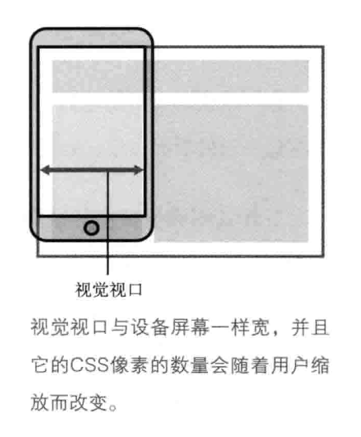
 </div>	
	
### 理想视口
 
  对于移动端网页，默认的布局视口的宽度并不是一个理想的宽度，我们不希望需要通过缩放查看内容，所以浏览器厂商引进了`理想视口`的概念，与理想视口宽度相同的网页是最理想的用户浏览的宽度，刚进入页面时用户不需要缩放。
  
  那对于移动端网页，我们需要设置布局视口的宽度为理想视口的宽度。这需要在meta标签中声明： 
  
```xml
<meta name="viewport" content="width=device-width"/>
```

### 参考

- [移动web手册]()

## meta标签
上面提到了通过meta标签声明布局视口的宽度。		
meta标签的常用属性：

|属性|可选值|描述
|:---|:---|:---|
|charset|UTF-8等|声明当前文档所使用的字符编码|
|name|author、description 、keywords、 viewport等|把 content 属性关联到一个名称
|http-equiv|content-type 、expire 、refresh 、set-cookie|	把content属性关联到HTTP头部
|content|name属性相关的元信息，格式：key=value|定义与http-equiv或name属性相关的元信息|

对于viewport元标签格式：

```xml
<meta name="viewport" content="key=value, key=value"/>
```

其中content内容：

- `width`：布局视口宽度（数值 / device-width）（范围从200 到10,000，默认为980 像素）
- `height`：布局视口高度（数值 / device-height）（范围从223 到10,000）
- `initial-scale`：初始的缩放比例 （范围从>0 到10）
- `minimum-scale`：允许用户缩放到的最小比例
- `maximum-scale`：允许用户缩放到的最大比例
- `user-scalable`：用户是否可以手动缩 (no,yes)

对于移动端页面，常将布局视口宽度设置为理想视口宽度，并禁止缩放：

```xml
<meta name="viewport" content="width=device-width, initial-scale=1.0,maximum-scale=1.0, user-scalable=no"/>

```
### 参考
- [MDN meta标签](https://developer.mozilla.org/zh-CN/docs/Web/HTML/Element/meta)

## 媒体查询

**媒体查询类型**

- 媒介类型查询
- 视口相关
- 特性相关

**语法**

```
@media 媒体类型 and (视口特性阀值){
    // 满足条件的css样式代码
}
```
**媒体查询示例**

```css
.sample {
    background-image: url(sample.png);
    width: 300px;
    height: 200px;
}
 
@media only screen and (-Webkit-min-device-pixel-ratio: 1.5),
  only screen and (-moz-min-device-pixel-ratio: 1.5),
  only screen and (-o-min-device-pixel-ratio: 3/2),
  only screen and (min-device-pixel-ratio: 1.5) {
    .sample {
        background-image: url(sample@2x.png);
    }
}
```

**更多用法参考**

- [W3C关于媒体查询的介绍](https://www.w3.org/TR/css3-mediaqueries/)
- [W3C 媒体查询标准](https://www.w3.org/TR/css3-mediaqueries/)


