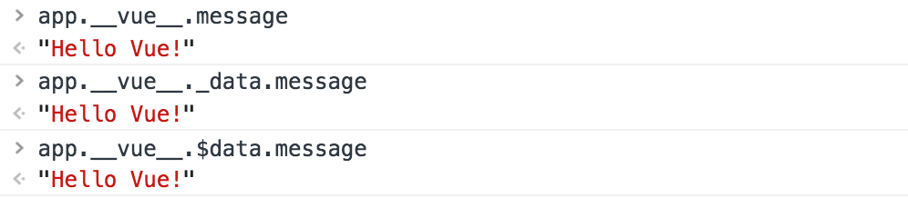
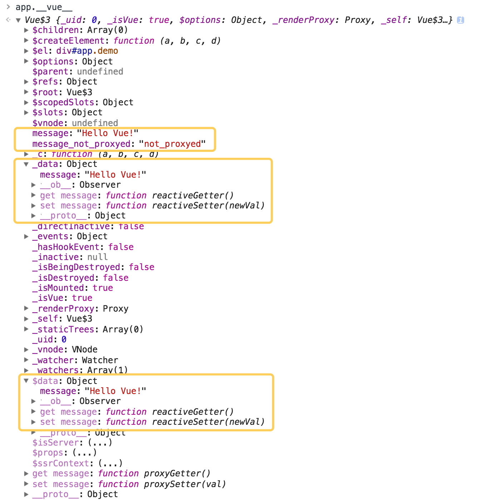

- [vue 双向数据绑定实现原理](https://juejin.im/entry/59116fa6a0bb9f0058aaaa4c)
- [Vue 源码解析：深入响应式原理 ](https://github.com/DDFE/DDFE-blog/issues/7)
- [luobotang/simply-vue](https://github.com/luobotang/simply-vue)


数据劫持: vue.js 则是采用数据劫持结合发布者-订阅者模式的方式，通过Object.defineProperty()来劫持各个属性的setter，getter，在数据变动时发布消息给订阅者，触发相应的监听回调。

1、 new Vue实例，将data中的属性代理到实例上。对data中的每个属性监听，为data中的每个属性new 一个Dep对象，用来存储订阅者 watcher和发布通知。
编译 HTML：nodeToFragement(id)。编译HTML时为每个与数据绑定相关的节点new 一个Watcher实例，并把它添加到相应属性的dep对象中（在Watcher构造函数中触发相应属性的get方法，在get方法中将watcher添加到dep）。


数据初始化

2、view > model

视图变化时，如果有v-model属性，会执行v-model指令的逻辑，更新对应的data属性。如果没有，而有事件处理函数的话会执行事件处理函数。

3、model > view

data中的属性改变时，触发属性的set方法。在set方法中会调用相应dep的notify通知watcher，执行watcher的update方法，更新节点的nodeValue.(get方法中添加watcher回调)


```html
//index.html
<body>
	<div id="app">
	  {{ message }}
	</div>
</body>
```

```javascript
//main.js
import Vue from 'vue'
var app = new Vue({
  el: '#app',
  data: {
    message: 'Hello Vue!'
  }
})
```

页面展示： Hello Vue!

页面源码“

```
<body>
    <div id="app">
      Hello Vue!
    </div>
  <script type="text/javascript" src="/app.js"></script>
</body>
```

打开控制台：


这里可以看出来，我们new的一个Vue实例挂载在id为app的DOM节点上

控制台输入
>app.__vue__.message = 'bye bye'

页面显示 bye bye

官方文档所说的[修改 app.message页面能相应地更新](https://cn.vuejs.org/v2/guide/index.html#声明式渲染)并不起作用，这里app.message = 'houhou' 没有反应,app.__vue__.message也没有变化。

这里有几个地方有message变量，且值是 ``` Hello Vue!```

- app.__vue__.message
- app.__vue__._data.message
- app.__vue__.$data.message



在控制台修改 app.\_\_vue\_\_.message、app.\_\_vue\_\_.\_data.message、app.__vue__.$data.message中热任意一个都能让页面展示数据发生相应变化，并且其他两个都会相应变化。

[官方文档](https://cn.vuejs.org/v2/guide/instance.html#属性与方法)有这么一句话： **每个 Vue 实例都会代理其 data 对象里所有的属性**。这也是为什么app.__vue__会有message的原因。并且**只有这些被代理的属性是响应的。如果在实例创建之后添加新的属性到实例上，它不会触发视图更新。**

```
//main.js
import Vue from 'vue'
var app = new Vue({
  el: '#app',
  data: {
    message: 'Hello Vue!'
  }
})
app.message_not_proxyed = 'not_proxyed'
```
在Vue实例创建后，再添加属性message\_not\_proxyed到实例上


可以看到，Vue实例上添加了属性，但\_data和$data中并没有。

那挂载在DOM上的Vue实例为什么会有\_data、$data这样的区分呢？它们都有什么作用呢？创建Vue实例都干了什么？

先来回答最后一个问题：一张图就可以解释


在这个过程中，如果用户定义了生命周期钩子，则会执行生命周期钩子函数


官网文档说：**Vue 实例暴露了一些有用的实例属性与方法。这些属性与方法都有前缀 $**

那应该是暴露出来的用户使用的吗？


--------分割线------这里是粗糙笔记

**vue组件不能从父组件接收所有prop吗？**

跨组件数据流，自定义事件通信以及构建工具集成

所有的 Vue.js 组件其实都是被扩展的 Vue 实例。

你的站点上动态渲染的任意 HTML 可能会非常危险，因为它很容易导致 XSS 攻击

指令的职责就是当其表达式的值改变时相应地将某些行为应用到 DOM 上

在 v-bind 用于 class 和 style 时， Vue.js 专门增强了它。表达式的结果类型除了字符串之外，还可以是对象或数组

过滤器，可被用作一些常见的文本格式化，过滤器只能在 mustache 绑定和 v-bind 表达式

指令修饰符

缩写

计算属性的缓存特性
/Users/chang/vue/vue-example/build
computed vs methods vs watch


computed ： 只有原始数据变化才需要计算更新的数据
watch,数据变化时，执行异步操作或开销较大的操作。watch 选项允许我们执行异步操作（访问一个 API），限制我们执行该操作的频率，并在我们得到最终结果前，设置中间状态。这是计算属性无法做到的


v-for  数组迭代、对象迭代、整数迭代


key的用途

```
<!-- 完整语法 -->
<a v-bind:href="url"></a>
<!-- 缩写 -->
<a :href="url"></a>
```

```
<!-- 完整语法 -->
<a v-on:click="doSomething"></a>
<!-- 缩写 -->
<a @click="doSomething"></a>
```

v-once 与 shouldComponentUpdate